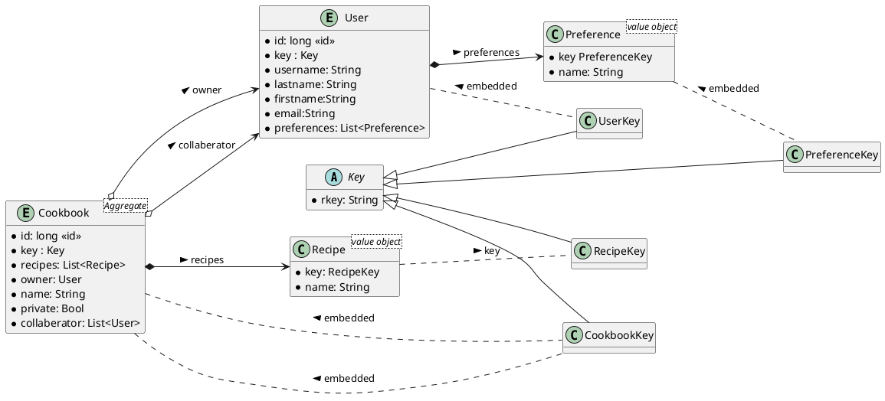

```plantuml
@startuml
hide empty methods
left to right direction

abstract Key {
   *rkey: String  
   
}

class Recipe <value object>{
  *key: RecipeKey
  *name: String
}
class Preference <value object> {
  *key PreferenceKey
  *name: String
}
class UserKey{}
class RecipeKey{}
class CookbookKey{}
class PreferenceKey{}


entity User {
    *id: long <<id>>
    *key : Key
    *username: String
    *lastname: String
    *firstname:String
    *email:String
    *preferences: List<Preference>
}

entity Cookbook <Aggregate> {
    *id: long <<id>>
    *key : Key
    *recipes: List<Recipe>
    *owner: User
    *name: String
    *private: Bool
    *collaberator: List<User>

}
Cookbook .. CookbookKey : < embedded
Recipe .. RecipeKey : > key
Preference .. PreferenceKey : < embedded
User .. UserKey : < embedded
User *--> Preference : > preferences
Cookbook *--> Recipe : > recipes
Cookbook o-->  User : > collaberator
Cookbook o-->  User : > owner
Cookbook .. CookbookKey : < embedded

Key <|-- RecipeKey
Key <|-- CookbookKey
Key <|-- PreferenceKey
Key <|-- UserKey
@enduml

```