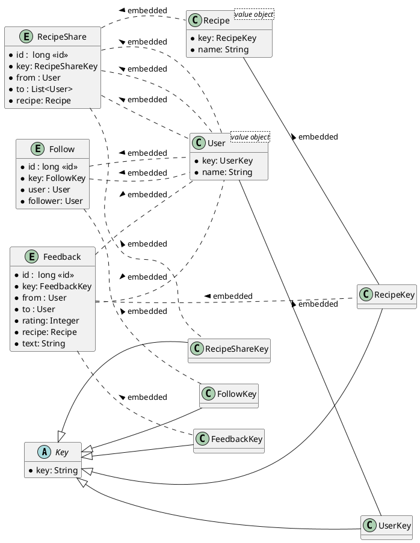

```plantuml
@startuml
hide empty methods
left to right direction

abstract Key  {
   *key: String  
}

class UserKey{
}
class User <value object> {
   *key: UserKey
   *name: String
}
class FollowKey  {
}
class FeedbackKey  {
}
class RecipeShareKey  {
}

class RecipeKey  {}

class Recipe <value object> {
   *key: RecipeKey 
   *name: String
}


entity Follow  {
    *id : long <<id>>
    *key: FollowKey
    *user : User
    *follower: User
  
}

entity Feedback  {
    *id :  long <<id>>
    *key: FeedbackKey
    *from : User
    *to : User
    *rating: Integer
    *recipe: Recipe
    *text: String

}
entity RecipeShare  {
    *id :  long <<id>>
    *key: RecipeShareKey
    *from : User
    *to : List<User>
    *recipe: Recipe
}
Follow .. User : < embedded
Follow .. User : < embedded
Follow .. FollowKey : < embedded 
Feedback .. User : < embedded
Feedback .. User : < embedded
Feedback .. RecipeKey : < embedded
Feedback .. FeedbackKey : < embedded 
RecipeShare .. User : < embedded 
RecipeShare .. User : < embedded 
RecipeShare .. User : < embedded
RecipeShare .. Recipe : < embedded
RecipeShare .. RecipeShareKey: < embedded
Key <|-- RecipeKey
Recipe -- RecipeKey : < embedded
User -- UserKey : < embedded
Key <|-- FeedbackKey
Key <|-- FollowKey
Key <|-- UserKey
Key <|-- RecipeShareKey
```